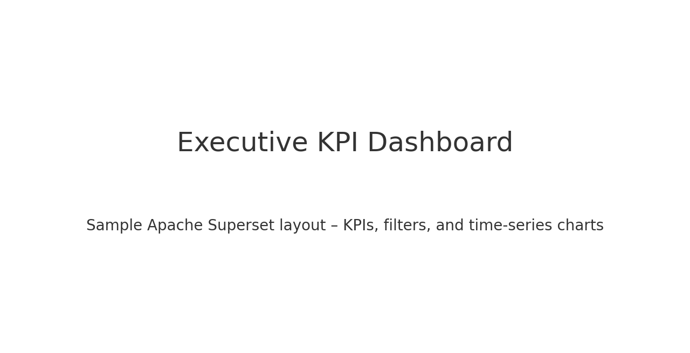

# Apache Superset Developer Portfolio – Akhil Reddy

This repository showcases my hands-on experience building advanced dashboards, reusable datasets, Jinja-templated SQL queries, and custom visualizations in **Apache Superset**.  
All examples use **public / dummy datasets** and demonstrate the same capabilities I use for enterprise clients such as JPMorgan Chase, Johnson & Johnson, Lowe’s, Dell, and Iridium Communications.

---

## 🔥 Key Superset Skills Demonstrated

### ✅ Dashboard Development
- Advanced filters, drilldowns, cross-filters
- Cascading filters and parameterized controls
- KPI cards, charts, tables, and custom ECharts visuals
- Hyperlink drill-through navigation between dashboards
- Modular, reusable dashboard templates

### ✅ SQL / Analytics
- Window functions (`DENSE_RANK`, `ROW_NUMBER`, `LAG`, `LEAD`)
- Time-series transformations
- Ranking, segmentation, cohorting
- CTE-based ETL logic for metric modeling

### ✅ Jinja Templating
- Dynamic SQL queries
- Parameter-based filtering
- Conditional rendering
- Date macros (`filter_values`, `form_data` variables)

### ✅ UI Customization
- Custom CSS overrides for branding
- Component spacing, color palette, typography adjustments
- Custom HTML tooltips

---

## 📊 Portfolio Dashboards (Screenshots)

Below are the dashboards recreated using public datasets.  
*(Please upload your actual Superset screenshots here)*

### 1️⃣ Executive KPI Dashboard  
`/dashboards/executive_kpis/`  

### 2️⃣ Operations Performance Dashboard  
`/dashboards/operations_performance/`  

### 3️⃣ Financial Trend & Ranking Dashboard  
`/dashboards/financial_trends/`  

---

## 🗂 Folder Structure

